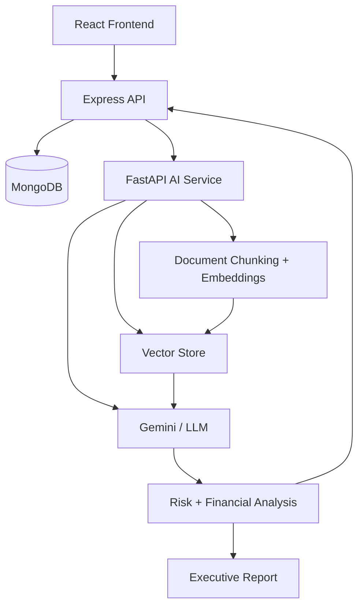

# AI Due Diligence Copilot

An AI-powered platform that automates company due diligence. Upload financial statements, filings, investor decks, and market reports for a company — the system extracts key information, assesses risk, and generates a source-backed executive due-diligence report.

> **Status**: Active development. Core CRUD, data model, and dashboard are implemented. The RAG/AI analysis pipeline is in progress — see [Roadmap](#roadmap).

---

## What it does

Instead of manually reading through hundreds of pages of company documents, an analyst can:

1. Add a company and upload its documents (financial, legal, commercial, technical)
2. Let the system analyze each document and extract financial metrics and risk findings
3. View a calculated, data-driven risk breakdown across five categories (Financial, Legal, Commercial, Operational, Technology)
4. Generate an executive summary and full due-diligence report — with every conclusion traceable back to its source document

---

## Architecture



- **Frontend (React)** — dashboard UI for companies, documents, risk analysis, and reports
- **Backend (Node.js + Express)** — owns the data model, auth, and REST API; single source of truth for MongoDB writes
- **Database (MongoDB + Mongoose)** — Company, Document, and Report collections
- **AI Service (FastAPI, Python)** — handles document ingestion, chunking, embeddings, vector retrieval, and LLM-based analysis; returns structured results to Express rather than writing to MongoDB directly

This is a polyglot split by design: Python's RAG/ML tooling is more mature than Node's, so document analysis is isolated into its own service while the core app stays on a standard JS full-stack.

---

## Tech stack

| Layer | Technology |
|---|---|
| Frontend | React, React Router, Tailwind CSS, Lucide React |
| Backend | Node.js, Express.js |
| Database | MongoDB, Mongoose |
| AI service | FastAPI (Python), embeddings + vector store, Gemini |
| AI technique | Retrieval-Augmented Generation (RAG) |

---

## Data model

Company
├── Documents (companyId ref)
└── Reports (companyId ref)


**Document**
- `name`, `type` (Financial / Legal / Commercial / Technical / Other)
- `status`: `Uploaded` → `Processing` → `Analyzed` (→ `Failed`)
- `analysis`: `{ overallRisk, financialMetrics[], riskFindings[] }`

**Report**
- `companyId`, `title`, `summary`, `overallRisk`
- `financialMetrics`, `risks`, `insights`, `recommendations`

---

## Features

**Implemented**
- [x] Company creation, listing, search, and detail view
- [x] Document upload and company association
- [x] Document, Company, and Report data models
- [x] Risk levels and risk categories (badges, cards)
- [x] Risk Analysis dashboard with calculated counts/percentages
- [x] Report generation and display (executive summary, financial metrics, findings)

**In progress**
- [ ] Risk Distribution graph fed from live calculated data
- [ ] Dynamic per-category risk findings (replacing sample data)
- [ ] FastAPI RAG service: chunking, embeddings, vector retrieval
- [ ] Source-backed citations linking findings back to source documents
- [ ] `Failed` document status + error handling for analysis pipeline

See [Roadmap](#roadmap) for the fuller picture.

---

## Getting started

### Prerequisites
- Node.js 18+
- MongoDB (local or Atlas)
- Python 3.10+ (for the AI service)
- A Gemini/LLM API key

### Backend (Express)
```bash
cd server
npm install
cp .env.example .env   # set MONGODB_URI, PORT, etc.
npm run dev
```

### AI service (FastAPI)
```bash
cd ai-service
python3 -m venv venv
source venv/bin/activate
pip install -r requirements.txt
cp .env.example .env   # set GEMINI_API_KEY / ANTHROPIC_API_KEY
uvicorn app.main:app --reload --port 8001
```

### Frontend (React)
```bash
cd client
npm install
npm run dev
```

---

## API overview

| Method | Endpoint | Description |
|---|---|---|
| `POST` | `/api/companies` | Create a company |
| `GET` | `/api/companies` | List all companies |
| `GET` | `/api/companies/:id` | Get a single company |
| `POST` | `/api/companies/:id/documents` | Upload a document for a company |
| `GET` | `/api/risk-analysis` | Get calculated risk counts/percentages across analyzed documents |
| `GET` | `/api/companies/:id/report` | Get the generated due-diligence report |

---

## Roadmap

1. Stand up the FastAPI AI service (ingestion → chunking → embeddings → vector store)
2. Wire Express → FastAPI for async document analysis, updating `status` through `Processing` → `Analyzed`
3. Replace hardcoded/sample financial metrics and risk findings with real extracted data
4. Add source citations so every finding links back to the originating document and page/section
5. Populate the Risk Distribution graph from live data instead of static values
6. Add authentication and per-user/per-team access control

---

## Disclaimer

This project is under active development. Some financial metrics and risk findings currently shown in the UI are sample/fictitious data used for testing and are clearly marked as such — real extracted analysis is part of the in-progress RAG pipeline.

## License

MIT

